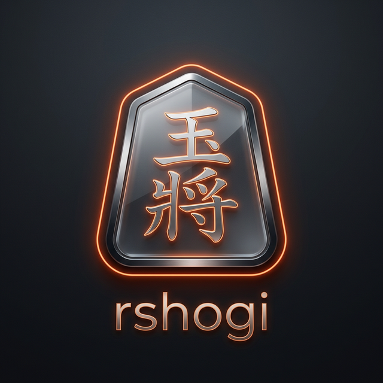

<div align="center">



# rshogi

**A modern, native Shogi client built with Rust**

[](https://www.rust-lang.org/)
[](https://www.gpui.rs/)
[](#)
[](#)

*Crisp board rendering · 20+ themes · Multiple piece & board skins · Annotation tools*

</div>

---

## ✨ Overview

**rshogi** is a desktop Shogi application written in Rust from scratch. It features a polished, IDE-inspired workspace powered by [GPUI](https://www.gpui.rs/) — the same GPU-accelerated UI framework behind the Zed editor — with an optional egui back-end for lightweight builds.

The goal is to bring a Shogi playing and analysis experience as refined as the best chess GUIs, entirely in safe, performant Rust.

---

## 🎯 Features

| Feature | Details |
|---|---|
| **Dual UI back-ends** | Primary: `GPUI` (GPU-accelerated). Alternative: `egui` (portable) |
| **Dock workspace** | IDE-style layout with resizable Board, Inspector, and Console panels |
| **Full menu bar** | File / Edit / View / Game / Tools / Help menus with keyboard shortcuts |
| **Theme engine** | 20+ built-in themes – Catppuccin, Tokyo Night, Gruvbox, Solarized, and more |
| **Piece & board skins** | Multiple piece wallpapers (western, ryoko_1kanji) + 11 board textures |
| **Annotation tools** | Right-click to draw circles and arrows on the board |
| **Move highlighting** | Visual feedback for selected squares, legal destinations, and last action |
| **Promotion dialog** | Smooth in-place card overlay for promotion choice |
| **Drag & drop** | Drag pieces from board or hand with ghost preview |
| **Sound effects** | Move/capture audio via `rodio` (15 OGG samples from lishogi) |
| **Bitboard core** | Powered by the [`shogi`](https://crates.io/crates/shogi) crate for fast move generation |

---

## 🏗️ Architecture

```
rshogi/
├── src/
│   ├── core/          # Game logic (move gen, state machine)
│   ├── ui_gpui/       # GPUI front-end (default)
│   │   ├── app.rs         # Application entry
│   │   ├── workspace.rs   # Dock workspace & menus
│   │   ├── render.rs      # Board, pieces, overlays
│   │   ├── interaction.rs # Mouse events & drag-and-drop
│   │   ├── assets.rs      # Wallpaper & sound asset registry
│   │   ├── model.rs       # UI state model
│   │   └── sound.rs       # Audio playback
│   └── ui/            # egui front-end (optional)
├── assets/
│   ├── pieces/        # SVG piece sets (western, ryoko)
│   ├── boards/        # Board texture images
│   └── sounds/        # OGG move sound effects
└── themes/            # JSON theme definitions (20+ themes)
```

---

## 🚀 Quick Start

### Prerequisites

- [Rust](https://rustup.rs/) (edition 2024, stable)
- A C compiler (for platform windowing)

### Build & Run

**With GPUI (default, recommended):**
```bash
cargo run
# or explicitly:
cargo run --features ui-gpui
```

**With egui (lightweight alternative):**
```bash
cargo run --no-default-features --features ui-egui
```

**Release build:**
```bash
cargo build --release
./target/release/rshogi
```

---

## 🎨 Themes

Switch themes at runtime via **View → Theme**. rshogi ships with 20+ hand-crafted themes:

<table>
  <tr>
    <td>🌸 Catppuccin</td>
    <td>🌙 Tokyo Night</td>
    <td>🍂 Gruvbox</td>
    <td>🌿 Everforest</td>
  </tr>
  <tr>
    <td>☀️ Solarized</td>
    <td>🌊 Ayu</td>
    <td>🧊 Flexoki</td>
    <td>🖤 Molokai</td>
  </tr>
  <tr>
    <td>🟢 Matrix</td>
    <td>🦆 Jellybeans</td>
    <td>🌌 Space Duck</td>
    <td>🌅 Fahrenheit</td>
  </tr>
  <tr>
    <td colspan="4">…and 8 more: Adventure, Alduin, Harper, Hybrid, Kibble, Mellifluous, Macos Classic, Twilight</td>
  </tr>
</table>

---

## 🖱️ Controls

| Action | Input |
|---|---|
| Select / move piece | Left click |
| Drag piece | Left click + hold → drag → release |
| Draw circle | Right click on square |
| Draw arrow | Right click + drag |
| Clear annotations | Toolbar eraser button |
| Change theme | View → Theme |
| Change board skin | View → Appearance → Board |
| Change piece set | View → Appearance → Piece |

---

## 📦 Key Dependencies

| Crate | Purpose |
|---|---|
| [`gpui`](https://crates.io/crates/gpui) | GPU-accelerated UI framework (Zed editor's engine) |
| [`gpui-component`](https://crates.io/crates/gpui-component) | UI component library (buttons, dock, menus, icons) |
| [`shogi`](https://crates.io/crates/shogi) | Shogi rules engine & bitboard move generation |
| [`rodio`](https://crates.io/crates/rodio) | Cross-platform audio playback |
| [`rust-embed`](https://crates.io/crates/rust-embed) | Embed assets directly into the binary |
| [`eframe`](https://crates.io/crates/eframe) / [`egui`](https://crates.io/crates/egui) | Alternative egui UI back-end |

---

## 🗺️ Roadmap

- [ ] Save / load game records (KIF / CSA / USI formats)
- [ ] Undo / redo move history
- [ ] USI engine integration for computer play & analysis
- [ ] Online play (lishogi API)
- [ ] Move list / notation panel
- [ ] Board flip for Black-side perspective

---

## 🤝 Contributing

Contributions are welcome! Please open an issue or pull request. When adding piece or board assets, follow the naming conventions in [`assets/README.md`](assets/README.md) and ensure you respect the original asset licenses.

---

## 📄 License

This project is licensed under the **MIT License**.  
Third-party assets (pieces, boards, sounds) are sourced from [lishogi](https://lishogi.org) — please refer to their respective licenses before redistribution.

---

<div align="center">

Made with ❤️ and Rust 🦀

</div>
